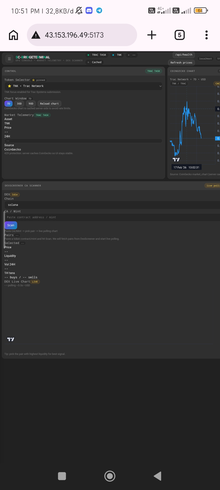
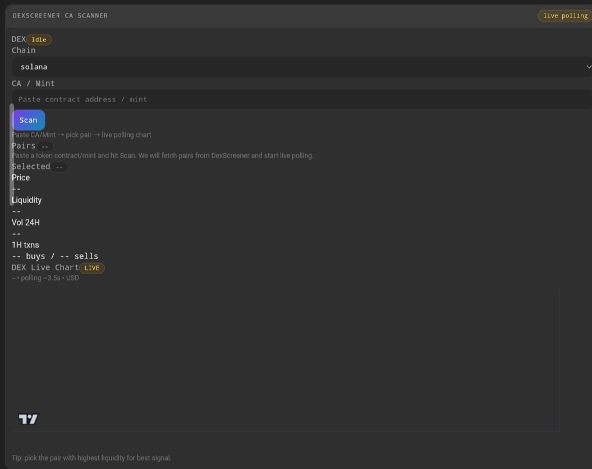

<div align="center">

# ⚡ SC-BRIDGE TERMINAL

<p>
  
  
  
  
  
</p>

> Pro Web Dashboard • Market Telemetry • Dex Scanner • CoinGecko Chart  
> Built for **Intercom Task (Trac Systems)**

### 🔗 Trac Address
`trac16rx782grsr53w6j5pldfvryjau4clau7p7snnkjun65xaz9kjx9qd4n3hy`

<p><sub>⚠️ Not financial advice • For telemetry & research only</sub></p>

</div>

---

## 🧠 What is this?

**SC-BRIDGE TERMINAL** is a **localhost-first dashboard** designed to feel like a **pro trading console**:

- 📡 **Realtime market telemetry** (CoinGecko)
- 📊 **Chart timeframes** (7D / 30D / 90D)
- 🔎 **Token scanner** by CA / Mint (DexScreener)
- ⚡ **Server-side caching** to reduce CoinGecko 429 rate-limit issues
- 🖥️ **Clean pro UI** (mobile-friendly)

---

## ✨ Key Features

- ✅ Pro dark dashboard UI
- ✅ CoinGecko price telemetry (cached)
- ✅ Lightweight chart rendering
- ✅ DexScreener CA scanner (Solana supported)
- ✅ Node.js API proxy (keeps keys & calls server-side)
- ✅ Anti rate-limit cache system (stability-first)
- ✅ Mobile-ready layout (VPS friendly)

---
## 📸 Proof

### 🖥️ Dashboard UI


### 📊 Live Chart Working


### 🔎 Dex Scanner Section


---

## ⚙️ Run Locally / VPS

### 1) Clone
```bash
git clone https://github.com/nusnuga/SC-BRIDGE-TERMINAL.git
cd SC-BRIDGE-TERMINAL/ui/collin
```

### 2) Install
```bash
npm install
```

### 3) Start API Server
```bash
node server/index.js
```

### 4) Start Web UI
```bash
npm run dev -- --host
```

### 5) Open
Local:
```
http://localhost:5173
```

VPS:
```
http://YOUR_SERVER_IP:5173
```

---

## 🔌 API Endpoints

- `GET /api/health`
- `GET /api/coingecko/simple_price`
- `GET /api/coingecko/market_chart`

---

## ⚠️ Notes

- CoinGecko can return `429` (rate limit)
- Server caching reduces spam & keeps UI stable
- Dex scanner requires valid **CA / Mint**
- This tool does **not** guarantee accuracy or profits

---

## 🧱 Tech Stack

- **React + Vite**
- **Node.js** (API Proxy)
- **CoinGecko API**
- **DexScreener API**
- **Lightweight Charts**

---

## ✅ Status Checklist

- ✅ UI: Stable
- ✅ API: Running
- ✅ Chart: Working
- ✅ VPS Deploy: Success

---

<div align="center">

### 🔥 Built for Intercom • Trac Systems Task  
<sub>SC-BRIDGE TERMINAL — telemetry-grade dashboard for fast token scanning</sub>

</div>
